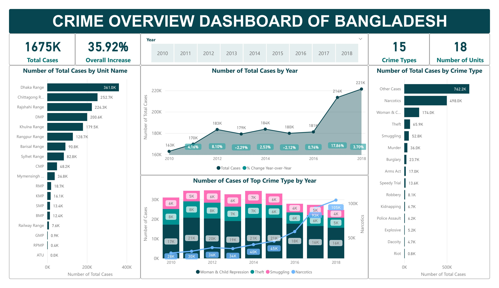
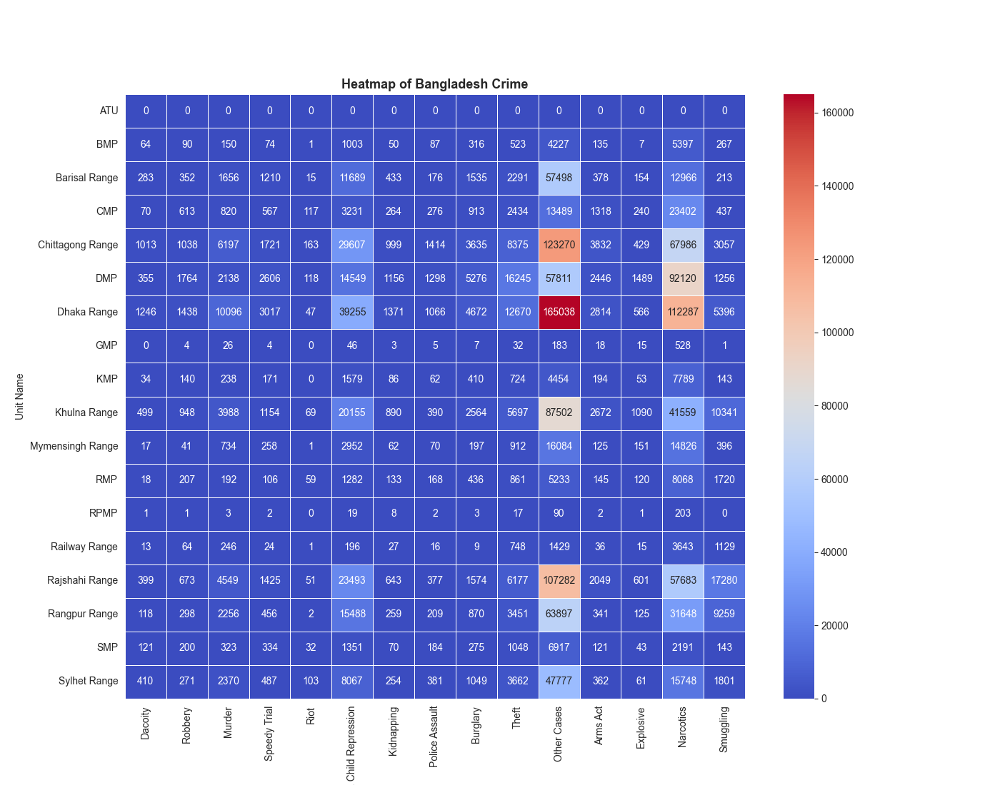

# Bangladesh Crime Analysis (2010–2018) 📊

This project is a **Power BI dashboard** analyzing crime data across Bangladesh from **2010 to 2018**.  
The dashboard highlights key insights into crime trends, regional distributions, and case categories.  

---

## 🚀 Project Overview
- **Total Cases Analyzed**: 1.67 Million+  
- **Time Period**: 2010–2018  
- **Regions Covered**: All major police ranges & metropolitan areas in Bangladesh  
- **Goal**: Transform raw crime statistics into **clear, visual, and actionable insights** for policymakers, law enforcement, and researchers.  

---

## 📌 Key Insights
- 📈 **35.9% increase** in total crimes over 9 years  
- 🏙️ **Dhaka Range** recorded the highest crime counts  
- 🚨 **Narcotics, Theft, and Repression cases** are the most significant categories  
- ⚖️ Regional disparities show concentration of crimes in metropolitan areas  

---

## 📊 Dashboard Preview

### Main Dashboard  

### Heatmap of Crime by Region & Category  

---

## 🛠️ Tools & Skills
- **Power BI** → Data Visualization, DAX  
- **Excel/CSV** → Data Cleaning & Preparation  
- **Data Analysis** → Identifying trends, comparing regions, and finding key patterns 
- **Heatmap** → Using python in Power BI
