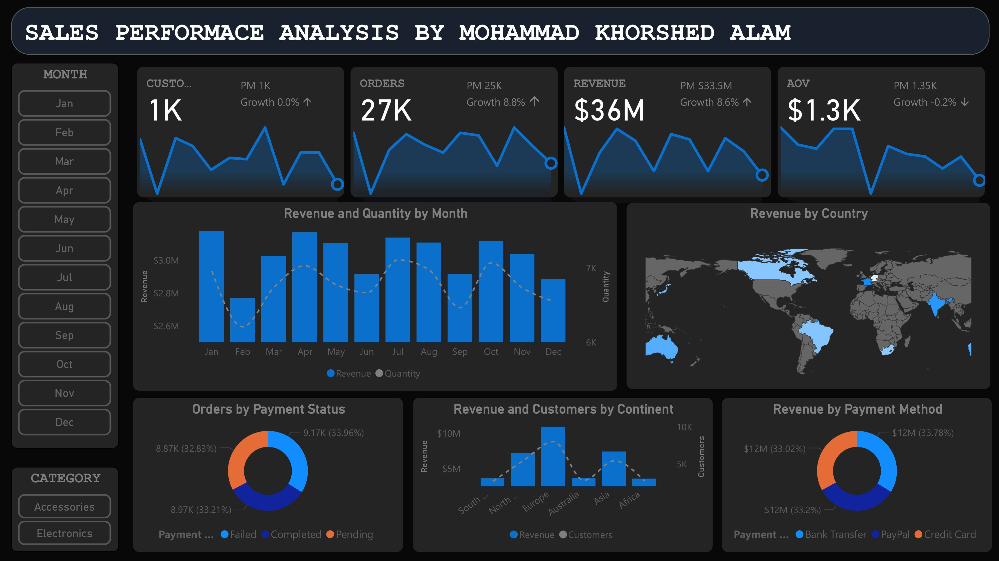

# 📊 E-commerce Sales Performance Dashboard

This project showcases an **E-commerce Sales Performance Dashboard** built in **Power BI**.  
The dashboard provides a comprehensive analysis of sales, revenue, customers, and orders, helping businesses track performance and identify insights quickly.

---

## 🚀 Features

- **KPI Cards (Top Row)**  
  - Customers, Orders, Revenue, and Average Order Value (AOV)  
  - Sparkline trendlines for quick time-series insights  
  - Growth % comparison against previous month  

- **Interactive Filters**  
  - Month slicer (Jan–Dec)  
  - Category slicer (Accessories, Electronics, etc.)  

- **Detailed Visuals**  
  - **Revenue & Quantity by Month** (dual-axis column + line chart)  
  - **Revenue by Country** (map visualization)  
  - **Orders by Payment Status** (donut chart)  
  - **Revenue & Customers by Continent** (combo chart)  
  - **Revenue by Payment Method** (donut chart)  

---

## 📂 Dataset

The dataset represents **E-commerce Sales Data** with fields such as:  

- **Order Details:** Order ID, Order Date, Quantity, Payment Method, Status  
- **Customer Info:** Customer ID, Continent, Country  

*(Dataset used for learning/demo purposes only.)*

---

## 🛠️ Tools & Technologies

- **Power BI Desktop** – for building the dashboard  
- **DAX (Data Analysis Expressions)** – for KPIs, measures, and custom calculations  
- **SVG Measures** – for sparkline visuals inside KPI cards  
- **Data Transformation** – Power Query for cleaning and shaping data  

---

## 📈 Insights

- **Revenue Growth:** Total revenue reached **$36M**, showing an **8.6% increase** from the previous month.  
- **Orders Trend:** **27K orders**, up **8.8%** compared to last month.  
- **Global Reach:** Strong performance in **Europe, North America, and Asia**.  
- **Payment Methods:** Balanced use of **Bank Transfer, PayPal, and Credit Card**.  

---

## 📸 Dashboard Preview

---

## 🎯 Key Learnings

- Designing **dark theme dashboards** for better contrast and readability.  
- Creating **custom DAX-based SVG sparklines** inside cards.  
- Using **dual-axis visuals** to compare revenue vs. quantity.  
- Structuring dashboards with a **top-to-bottom insight flow**: KPIs → Trends → Breakdown → Geography → Payment Insights.  

---

## 📬 Author

👤 **Mohammad Khorshed Alam**  
🔗 [LinkedIn](https://www.linkedin.com/in/mohammadkhorshed/) 

