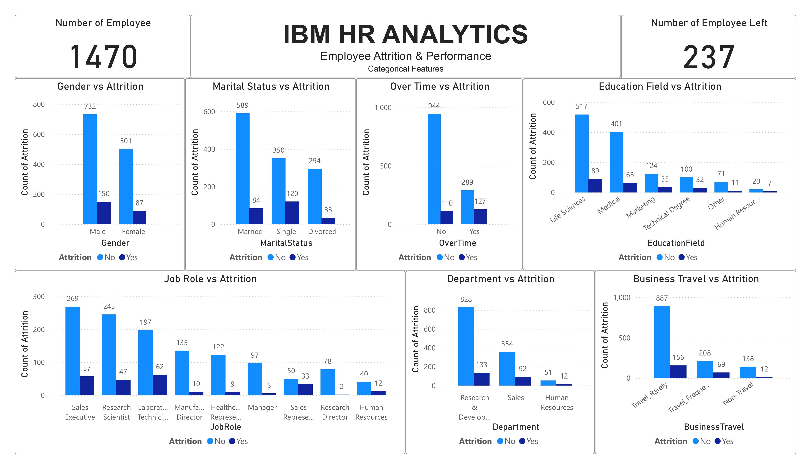

# IBM HR Analytics – Employee Attrition Analysis

## 📌 Overview
This project is part of my **Data Analysis with Power BI** practice, focusing on the **IBM HR Analytics Employee Attrition & Performance** dataset.  
The main objective is to explore the factors contributing to employee attrition and present the findings through interactive dashboards.

Currently, the analysis covers **categorical features vs. attrition**.  
In future updates, I will add a second dashboard focusing on **numerical features vs. attrition**.

---

## 📊 Dashboard Preview – Categorical Features vs Attrition

The dashboard displays how employee attrition varies across categorical factors such as:
- **Gender**
- **Marital Status**
- **Overtime**
- **Education Field**
- **Job Role**
- **Department**
- **Business Travel Frequency**

---

## 🛠 Tools Used
- **Power BI** – for data cleaning, transformation, and visualization
- **CSV Dataset** – IBM HR Analytics Employee Attrition & Performance

---

## 📈 Insights
- Employees doing overtime have significantly higher attrition rates.
- Sales department shows higher attrition compared to other departments.
- Certain job roles, such as Laboratory Technicians and Sales Executives, experience more attrition.

---

## 🚀 Next Steps
- Add **numerical features vs. attrition** dashboard.
- Perform deeper statistical analysis to identify strong predictors of attrition.
- Publish interactive Power BI dashboard online for public access.

---

## 📄 Dataset
The dataset is publicly available and contains information such as:
- Demographic details
- Job-related attributes
- Performance metrics
- Attrition status (Target variable)

---

## 💡 Author
**Mohammad Khorshed**  